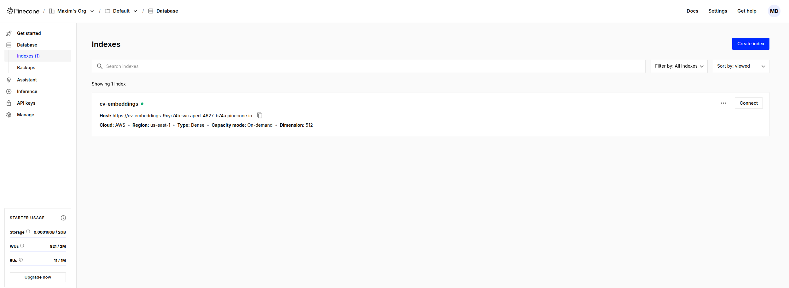

# RAG (Retrieval-Augmented Generation) for Document Q&A

Click here to watch the demo video on YouTube:

[](https://www.youtube.com/watch?v=513GaoDAdbI)

# Preparation

### Install Dependencies

```sh
pip install -r requirements.txt
```
>NOTE: The system was developed and tested with Python 3.11 and Ubuntu 22.04.5 LTS.

### Setup Pinecone Index with Document Embeddings

```sh
export PINECONE_API_KEY="your_pinecone_api_key"
```

Run the database builder to create embeddings and populate the Pinecone index:

```sh
python db_builder.py -d ./dataset/ -m jinaai/jina-embeddings-v2-small-en -n cv-embeddings -v
```
>NOTE: The only supported model for embeddings is `jinaai/jina-embeddings-v2-small-en`. Its being used in the chatbot for document retrieval and must be also used here to create the embeddings. 

Once the script finishes, you should see a Pinecone index named `cv-embeddings` populated with document embeddings in your Pinecone dashboard:



## Run the Q&A Application

Export the necessary API keys:

```sh
export PINECONE_API_KEY="your_pinecone_api_key"
export GROQ_API_KEY="your_groq_api_key"
```

Run the app:

```sh
streamlit run streamlit_chatbot.py
```

Go to `http://localhost:8501` in your web browser to interact with the chatbot. You will see a interface like this:


## Agentic Q&A Application

The agent will:

- Identify the name of the person in the user's question.
- Search the corresponding Pinecone index for that person's CV.
- If no name is found, it will default to a predefined name (e.g., "Maxim Dorogov").
- If more than one name is found, it will search all relevant indexes and combine the information.

### Setup Pinecone Index with Document Embeddings

You need to create an index per curriculum in the dataset. Run the following script to create multiple indexes, one for each CV in the `dataset/` folder:


```sh
python db_builder_multifile.py -d ./dataset/ -m jinaai/jina-embeddings-v2-small-en -v
```
>NOTE: All resumes in the dataset folder must be named as `cv-<name>-<surname>`.

## Run the Agentic Q&A Application
Export the necessary API keys:

```sh
export PINECONE_API_KEY="your_pinecone_api_key"
export GROQ_API_KEY="your_groq_api_key"
```

Run the app:

```sh
streamlit run streamlit_agentic_chatbot.py
```

Go to `http://localhost:8501` in your web browser to interact with the chatbot.

Click here to watch the demo video on YouTube:

[](https://www.youtube.com/watch?v=HqlSSUO1GDA)
